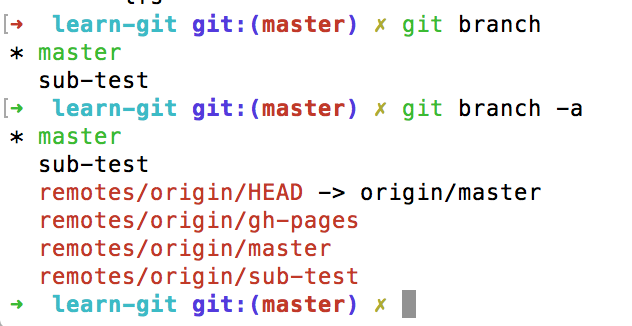

#我们编程吧 之 git 学习手册
**Version 1.2**

[TOC]

#Git 简介
Git是一个开源的软件，作者是大名鼎鼎的**Linus Torvalds**，写出**Linux**的那个哥们。

Git是一个专门用于做修改记录的程序，也被叫做**版本控制**软件。

## 安装Git
这个很简单，对于Windows和MacOSX还有对应的GUI版本可以使用。

 - Windows用户，参考[github@windows](windows.github.com)
 - Mac用户，参考[github@MacOSX](mac.github.com)
*Git不像别的软件，安装完成后不会在桌面上有个logo什么的，直接终端操作*

##设置Git
###查看git版本
在终端中输入`git --version`，比如我的输出为：

> git version 2.7.0

下面的设置主要是告诉git是哪位大神在用*git*。
###设定你的名字
`git config --global user.name "<yourname>"`
###设定你的邮箱
`git config --global user.email "<youremail@example.com>"`
###命令号颜色支持
`git config --global color.ui auto`

#新建repo
##repo
repo可以理解为一个被跟踪的文件夹，其中的任何内容做的任何更改都会被记录在册。

##新建一个repo
比如我们的文件夹就叫做`hello-world`吧。
执行下列指令：

 - 新建文件夹`mkdir hello-world`
 - 进入文件夹`cd hello-world`
 - 初始化`git init`

看看初始化成功没有，输入指令**git status**，只要不显示*fatal: Not a git repository...*，那就OK了。

恭喜了，第一步成功了。

#新增提交更改
##新建一个文件
假设现在在刚才建立的文件`hello-world`中，如果没有就妥妥滴进来。

新建一个文件，比如`vim readme`，然后输入一些简单的内容，比如
> hello git.

##查看git状态
这里我们可以检查目前repo的各种状态，比如是否有过任何修改，命令为：

>git status

此时的输出应该是类似下面这个样子：


##新增文件
此时我们就可以将readme文件添加到档案库里面去了。
>git add readme

**小技巧**如果当前文件较多，可以是用**git add .**来一股脑地把所有的文件都给新增了。

此时的输出应该是这个样子：


##提交文件
>git commit -m "Adding a readme file"

此时的输出应该是如下这个样子：


###如何撰写提交信息

提交信息对于以后的检查有着很重要的意义，所以要谨慎对待，千万不要写出下面的提交信息：
> git commit -m "Fix a Bug!"
> git commit -m "Fix two Bug!"

√，更改消灭了bug你是很爽，但是过了一年半载，如果你要重新审视你的修改，亦或者其他人来合并你的提交，就会头大。当然我们可以通过**git diff**来检查，没错呀，有本事你来试试。

提倡的做法，首先每个提交不要太大也不要太小，不要每天修改了N行代码后，只提交一次，也不要定义个变量就提交一次。通常是在修复了一个小的bug，增加了一个小的功能的时候就需要commit了，这个主要取决于经验，对于初学者建议，在认真写代码的情况下，过个10来分钟应该就需要commit了。

还有一个事情就是尽量在熟悉git后避免使用*-m*参数，因为这会让你在一次操作中把信息都提交了，会养成懒惰的习惯，我们尽量制定了编辑器后，直接使用**git commit**来填写header、body、issues等，这会让你添加更详细的信息。

Peter Hutter 很好滴说明了提交信息的重要性
> 重建一段代码的上下文是一种浪费。我们不能完全避免，我们只能努力尽最大可能去减少它。提交的信息就可以做到这一点，以至于一个提交信息可以表明一个开发者是不是一个很好的合作者。

这里有个7条很棒的git提交规则，供大家参考：

 1. 用一个空行隔开标题和正文
 2. 限制标题字数在 50 个字符内
 3. 用大写字母写标题行
 4. 不要用句号结束标题行
 5. 在标题行使用祈使语气
 6. 正文在 72 个字符处换行
 7. 使用正文解释是什么和为什么，而不是如何做


比如一个比较好的例子：

> Merge pull request #1234 from leo
> The pull request fix the bug ...
> Fixes #1234
> Closed #1234


##修改文件查看移动
在readme文件中新增一行，此时是用命令：
>git diff

可以看到如下输出结果：


##重构文件

从工作目录和暂存区删除文件
`git rm [filename]`
从暂存区删除文件但保存在当地
`git rm --cached [filename]`
更改文件名并准备commit
`git mv [filename-original] [file-renamed]`

# 注册github账号
##还在本地
其实到目前为止，你的代码还滞留在你自己的机器上，别人无法看到*（黑客除外）*。

此时我们就需要注册一个github账号，把自己优雅的代码共享给全世界。

##创建github账号
github是一个让所有人可以轻松上传自己代码，并协作的版本控制网站。
移步[github](https://github.com)。

注册完后，此时还记得如何设置自己的用户名吗，参考**设置git**。


#连接本机与远端repo
##远端repo
当你在github上创建了一个repo后，所有同步到该repo的代码都会保存到github的主机服务器上。此时的这个repo就被称为remote repository，你每次把自己的更改push到这个repo，就叫做同步sync。

其他人就可以通过pull你的这个remote repository来获取到你最新push的版本，存储到他们自己的电脑上。这样一来大家就可以共同的push、pull来协作修改同一个文件，而不用拿着U盘四处拷贝`省去病毒的传播，想当年去打印店的兄弟们...的U盘，哪个不是病毒缠身`。

push、pull的示意图如下所示：


##新建一个remote repository
此时我们准备将电脑上的版本和存在[github](https://github.com)的版本做同步，我们首先在github上新建一个repo。

 - 登陆[github](https://github.com)，点击右上角的`+`号来新增一个repo
 - 取一个名字比如hello-world，并给个简短的说明
 - 设定为public
 - 不要勾选`initialize with a README`，因为我们是从本机创建的git
 - 暂时不需要修改.gitignore贺license的设置
 - 创建repo

新建的地方在这里：


设置的东西在这里


##README、gitignore和License
一般在开源的软件中，都会看到这几个文件，含义如下：

 - README：通常用来解释一个程序的功能、安装及使用方法及一些贡献者等等
 - gitignore：这个主要是告诉git在更新文件的时候忽略掉那些不用跟踪的文件
 - License：用来声明一个程序可以或不可以被怎样使用

##连接本地的repo和remote的repo
先在我们已经在GitHub 上新建了一个repository，在github的官网的右上角可以看到如下图所示的一个地址，我们这里选择https。


然后进入hello-world文件夹

```
$ git remote add origin <your-git-repo-website>
```

现在我们的电脑本地repo就知道了在github上有一个remote repo，叫做**origin**，当然这个名字是可以修改的。此时origin代表的就是长长的那个网址。

##推送push修改到github上

接下来我们来推送一些本地的修改到github上的repo，因为我们总是希望本地的和github上的内容保持同步。

在推送之前，说下其实git有一个**branch**系统，可以修改一个程序不同的功能，后面会有介绍。通常系统会给我们的**branch**一个最初的名字**master**。

在我们需要推送的时候，需要告诉**git**准备推送哪一个分支的进度。

此时我们把我们的主分支**master**推送过去。

```
$ git push origin master
```

完成后，直接登录**github**的**hello-world**的**repo**页面，看看你创建的第一个repo吧。


#fork与clone


##forks
在上一节里面我们已经push了修改到github上，但如果只能这样，git未免太小儿科了，因为git最有趣的地方其实在于与不同的人来协作开发。

当你fork一个程序的repo时，其实是复制了一份软件的repo到你自己的github账号下面。


然后我们就可以在这个基础上来做一些开发了，比如新增一些功能、修正一些错误。

当我们成功fork一个repo后，我们就可以将它从github下载clone到我们自己的电脑上，这样在没有网络的情况下，我们也可以修改软件的内容。

## 如何打标签
标签tag主要是在完成了一个版本后，用于发布该版本。

相关的命令如下：

**列出标签**

```
git tag              # 打印出当前仓库的所有标签
git tag -l '1.0.*'   # 搜索符合模式的标签
```

**创建标签**

git标签有两种类型：*轻量标签*和*附注标签*，创建的方法如下所示：

```
git tag v1.0-light                 # 创建轻量标签，只有一个引用
git tag -a v1.0 -m 'Release 1.0'   # 创建附注标签，是个独立对象
```

一般创建都建议是附注标签（虽然轻量标签没有很多参数），搞个引用没有多大意思。

**切换标签**

切换标签与切换分支命令一样，是用checkout即可，比如：

```
git checkout v1.0.0    # 注意前提是版本存在，可以是用git tag先检查一下
```

**删除标签**

不需要或者误操作提交一个标签的时候，删除即可，使用的是delete的缩写

```
git tag -d v1.1.1
```

**标签发布**

一般情况下，*git push*不会将tag提交到服务端，我们需要显示的操作，如下所示：

```
git push origin v1.1.1
git push origin -tags
```


##下载Clone我们刚刚fork的repo

现在我们就可以将刚刚fork的repo下载到本地了，方法很简单：

```
$ git clone https://github.com/yourname/learn-git
```

，但是要比较留意，千万不要在已经是一个repo的文件夹里面来clone。

比如现在我们可能还在文件夹hello-world中，那么使用`cd ..`，到上一级目录，然后在执行clone的命令即可 。

完成后，直接使用`cd learn-git`进入到刚刚下载的软件目录里面去。

此时我们就拥有了一份这个软件的副本，并自动将其链接到了你github账号下面的远程repo中。

##链接到原始的repo中


到这里就有个问题了，我们是**fork**了别人的**repo**，但是如果别人的**repo**更新了，我们**fork**的**repo**是无法同步更新的。

而我们还是希望更新的，那么这个时候我们就需要新增另外一个remote来链接到原始的repo中，比如原始的repo位于`github.com/shaoguangleo/learn-git`上，该repo的地址可以在右上角找到。

先在我们起个名字，比如大家常用的upstream，执行下面的命令：
```
$ git remote add upstream https://github.com/shaoguangleo/learn-git.git
```
此时我们就通过upstream与原始的repo建立了链接。


#新建一个特性分支

##分支
**git**的软件**repo**使用分支**branches**来隔离开发进度。


当我们需要与其他人一起共同开发的时候，在完成自己负责的那一部分程序前，最好是创建自己的分支，这样就可以让主分支**master**保持稳定，不被未修改的修改影响。当你完成了自己的那一部分，就可以使用**merge**将分支修改合并进入**mater**主分支中。


##新建一个特性分支
在终端中输入`git branch`可以查看你位于哪个分支上。

此时我们开始着手新建一个分支吧，比如分支的名称是`sub-test`，那么此时使用命令

```
$ git branch sub-test
```
那么此时的`sub-test`分支降会拷贝当前`mater`的所有信息。

不过记住此时我们只是新建了一个分支，而我们目前还在主分支，这个可以使用`git branch`命令来查看。那么现在我们就进入到我们新建的分支：

```
$ git checkout sub-test
```
再次输入`git branch`命令会发现我们已经位于sub-test分支了。


##在子分支开始开发
此时我们在位于sub-test分支里面新建一个文件吧。

 - 新建一个文件命名为hello-sub
 - 在文件里面写入`hello git`

我们使用git将刚才的操作给记录下来：

 1. git status
 2. git add hello-sub
 3. git commit -m 'Add a new file in sub branch'
 4. git push origin **sub-test**

第四步特别注意，一定是将origin推送到我们刚才新建的sub-test子分支中。
并且在你提交的时候，git会提示你的修改已经提交到了一个新的分支。

**小技巧**一步搞定新建一个分支并进入该分支

```
$ git checkout -b new-sub
```

### 查看远程分支

使用**-a**参数可以查看远程分支，远程分支用红色标示出来。

```
$ git branch -a
```

### 删除远程分支和tag

在较高版本的git上，可以使用这种语法删除远程分支：

```
$ git push origin --delete <branchName>
```

删除tag这么用：

```
git push origin --delete tag <tagname>
```

### 重命名本地分支：

```
git branch -m devel develop
```




##与他人协作开发
其实最开始其他人员是没有push推送的权限的，这个时候我们如果希望大家协同开发，就需要在你的repo界面的右上方的setting那里，设置添加**Collaborators**，添加的人员就具有了直接参与推送的权限。


#与github同步

经常使用**pull**来同步更新，对于和许多人协作的repo而言，可以有效避免修改相同的文件造成版本的冲突。

```
$git pull <REMOTE-NAME> <LOCAL-BRANCH-NAME>
```

效果如下所示，直接从服务器远端更新到本地。

```
REMOTE       ---->    LOCAL
```

为了确保**pull**到东西，可以先行检查**remote**是否有所变动

```
$ git fetch --dry-run
```

#PR

这个设计不得不说，很赞。

对于我们修改或者完善了一份fork来的repo，通常希望把这些修改发给原作者，希望原作者可以pull收取我们的request，让大家都可以看到。


操作步骤如下所示：

 - 点击**New pull request**
 - 选择修改的分支
 - 输入修改的内容以及描述信息
 - 点击**Send pull request**

#合并

此时，我们就可以将我们的分支merge合并到主分支，删除旧的分支，并从upstream获得更新得到最新数据。

 - 切换到主分支，`git checkout master`
 - 合并子分支，`git merge sub-test`
 - 删除功能分支，`git branch -d sub-test`
 - 从github上删除该子分支，`git push <REMOTE-NAME> --delete <BRANCH-NAME>`
 - 从原来的repo获取更新，`git pull upstream master`

# 参考
1. https://git-scm.com


----------

#更多信息
Hi，XDJM们，更多信息欢迎移步[github](https://github.com/shaoguangleo)、[CSDN](http://blog.csdn.net/shaoguangleo)或微信公众号letsProgramming.


----------
